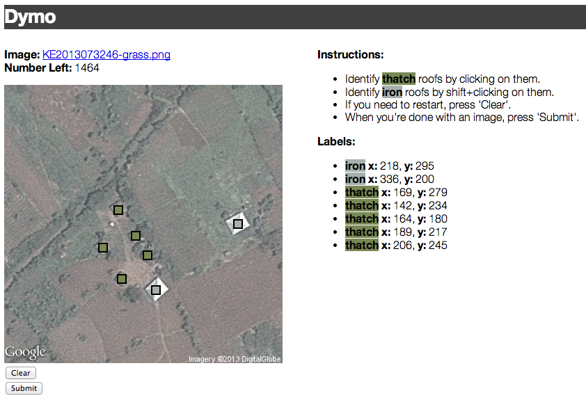

Dymo
============================

A `flask` app for quickly labelling featuers in images and recording their pixel positions.

For now, this app is specific to a datakind/give-directly project, but it might be useful for other applications in the future.

## Clone
```
git clone https://github.com/abelsonlive/labeller.git
``` 

## Requirements
Install `flask` and `redis`:
```
pip install flask redis
```

## Setup
* Startup redis:
  * `$ redis-server`
* Now, simply place the images you want to label in the `static/images` directory.  The filenames should be unique to each image and will be used as the primary key in the datastore.

## Run
Start up the UI:
```
python routes.py
```
And navigate to [`http://localhost:3030/`](http://localhost:3030/) for further instructions.

## Preview:


